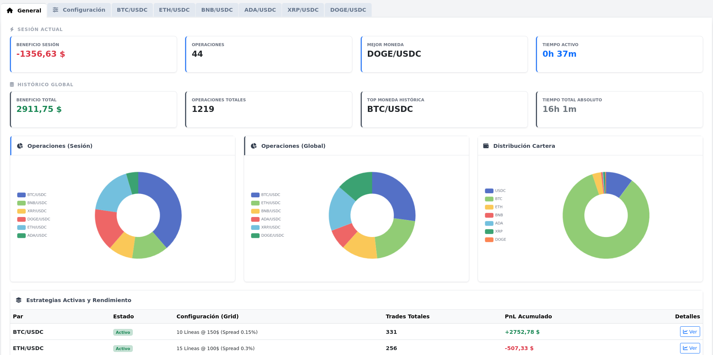
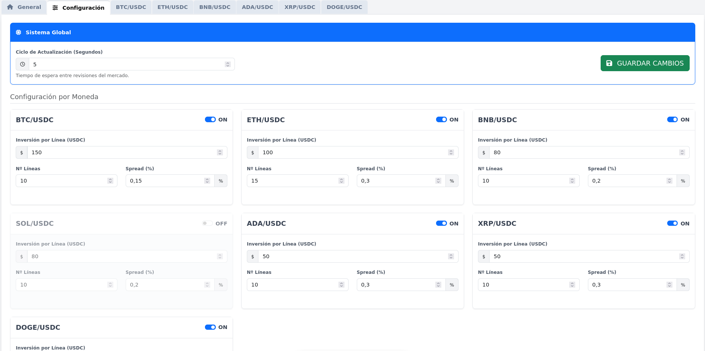

# ⚡ GridBot Pro - Binance Automated Trading


Un bot de trading automático de alta frecuencia basado en la estrategia **Grid Trading Estático**. Diseñado para **Binance** (Spot), cuenta con un panel de control web profesional, gestión manual de emergencia, estadísticas detalladas y persistencia de datos local.

---

## 📸 Capturas de Pantalla

| Dashboard General | Configuración Visual |
|:---:|:---:|
|  |  |
| *Vista global de PnL y Gráficos* | *Edición de estrategias sin tocar código* |

---

## 📖 Tabla de Contenidos

1. [¿Por qué este bot y no el del Exchange?](#-por-qué-este-bot-y-no-el-del-exchange)
2. [Características Principales](#-características-principals)
3. [Instalación Paso a Paso](#-instalación-paso-a-paso)
4. [Configuración y Uso](#-configuración-y-uso)
5. [Herramientas de Utilidad](#-herramientas-de-utilidad)
6. [Ayuda al Proyecto y soporte](#-soporte-y-donaciones)
7. [Aviso Legal (Disclaimer)](#-aviso-legal-disclaimer)

---

## 💡 ¿Por qué este bot y no el del Exchange?

Muchos usuarios se preguntan por qué complicarse con un bot propio si Binance ya tiene uno gratuito. Estas son las razones clave por las que **GridBot Pro** es superior para una operativa seria:

1.  **Grid Estático vs. Dinámico:** Los bots de los exchanges suelen mover la rejilla si el precio sube mucho (Trailing), lo que hace que compres cada vez más caro. Este bot utiliza niveles **ESTÁTICOS**. Te permite acumular activos en rangos concretos y venderlos solo cuando toca, maximizando el beneficio en mercados laterales.
2.  **Persistencia de Datos:** Cuando paras un bot en Binance, pierdes el historial visual de esa sesión. Este bot guarda **TODO** en una base de datos local (SQLite). Puedes apagarlo, reiniciar tu PC y volver a encenderlo sin perder el "contexto" de las operaciones ni los beneficios acumulados.
3.  **Privacidad y Control:** Tus estrategias y datos están en tu ordenador, no en la nube del exchange.
4.  **Gestión de Emergencia (Pánico):** Incluye un botón exclusivo de **"Vender a USDC"**. Si una moneda cae en picado o quieres salir rápido, puedes liquidar la posición al instante y recuperar liquidez sin tener que entrar a la app del exchange.
5.  **Multi-Par Real:** Puedes gestionar BTC, ETH, SOL y BNB simultáneamente desde un solo panel, viendo el rendimiento global de tu cartera de un vistazo.

---

## 🚀 Características Principales

### 🧠 Núcleo Inteligente
* **Grid Estático:** Compra bajo y vende alto en niveles predefinidos fijos.
* **Smart Reload 🔄:** Puedes cambiar la configuración desde la web con el bot en marcha. El sistema detecta los cambios y recalcula las rejillas al vuelo sin detener el servicio.
* **Protección de Inventario:** Si reinicias el bot, recuerda qué monedas tenía compradas para no venderlas con pérdidas.

### 🌐 Panel de Control Web (Dashboard)
* **Estadísticas Separadas:** Visión clara del rendimiento de la **Sesión Actual** (RAM) vs el **Histórico Global** (Base de Datos).
* **Gráficos Avanzados:**
    * Donuts de distribución de cartera y volumen de operaciones.
    * Gráficos de velas (Candlestick) con las **líneas de compra (verde) y venta (rojo) pintadas sobre el gráfico**.
* **Tabla de Órdenes Enriquecida:** Visualiza el precio de entrada estimado y el PnL (Ganancias/Pérdidas) latente de cada orden antes de decidir cerrarla.
* **Configurador Visual:** Modifica la inversión, el spread y los rangos directamente desde el navegador, sin tocar archivos de código.

---

## 🛠️ Instalación Paso a Paso

### 1. Instalar Python (Requisito Previo)
Necesitas tener Python instalado en tu sistema para ejecutar el bot.

* **Windows:**
    1.  Descarga la última versión (3.10 o superior) desde [python.org](https://www.python.org/downloads/).
    2.  **IMPORTANTE:** Al instalar, marca la casilla **"Add Python to PATH"** antes de darle a instalar.
    3.  Abre una terminal (PowerShell o CMD) y escribe `python --version` para comprobarlo.

* **Linux (Ubuntu/Debian):**
    Abre la terminal y ejecuta:
    ```bash
    sudo apt update
    sudo apt install python3 python3-venv python3-pip git
    ```

* **macOS:**
    Se recomienda instalarlo mediante Homebrew (`brew install python`) o desde la web oficial.

### 2. Clonar el Proyecto
Descarga el código del bot en tu ordenador:

```bash
https://github.com/catlinux/gridbot_binance.git
cd gridbot_binance
```

### 3. Crear Entorno Virtual
Esto aísla las librerías del bot para no interferir con tu sistema. Es una buena práctica esencial.

```bash
# En Windows:
python -m venv venv
venv\Scripts\activate

# En Linux / Mac:
python3 -m venv venv
source venv/bin/activate
```
*(Verás que aparece `(venv)` al principio de la línea de comandos).*

### 4. Instalar Dependencias
Instala todas las librerías necesarias (FastAPI, CCXT, Pandas, etc.) de golpe:

```bash
pip install -r requirements.txt
```

---

## ⚙️ Configuración y Uso

### 1. Credenciales de Binance (.env)
Por seguridad, las claves API nunca van en la web. Debes crear un archivo manual.
Crea un archivo llamado `.env` dentro de la carpeta `config/`.

**Contenido de `config/.env`:**
```dotenv
BINANCE_API_KEY=pon_aqui_tu_api_key
BINANCE_SECRET_KEY=pon_aqui_tu_secret_key
USE_TESTNET=True
```
* **IMPORTANTE:** Mantén `USE_TESTNET=True` para probar con dinero ficticio. Cambia a `False` solo cuando estés listo para usar dinero real.

### 2. Iniciar el Bot
Ejecuta el comando principal. Esto arrancará el motor de trading y el servidor web.

```bash
python main.py
```

### 3. Configuración de la Estrategia (Vía Web)
Una vez iniciado, abre tu navegador y ve a:
👉 **[http://localhost:8000](http://localhost:8000)**

1.  Ve a la pestaña **"Configuración"**.
2.  Ahí verás un formulario para cada moneda.
3.  Define:
    * **Inversión por línea:** Cuántos dólares quieres poner en cada orden.
    * **Nº Líneas:** Cuántas órdenes quieres tener activas.
    * **Spread (%):** Distancia entre compra y venta.
4.  Activa el interruptor **"ON"** en las monedas que quieras y pulsa **"GUARDAR CAMBIOS"**.

El bot comenzará a operar automáticamente.

---

## 🧹 Herramientas de Utilidad

Si has hecho pruebas y quieres "resetear" tu cuenta (cancelar todas las órdenes pendientes) sin vender las monedas que ya tienes:

```bash
python limpieza.py
```
Esto dejará tu cuenta limpia de órdenes limit, lista para apagar el sistema o empezar una estrategia nueva.

---

## ❤️ Ayuda al Proyecto y Donaciones

Este proyecto es Open Source y requiere muchas horas de desarrollo y mantenimiento. Si la herramienta te ha sido útil, te ha ayudado a aprender o te ha generado beneficios, considera hacer una pequeña donación. ¡Ayuda a mantener el código actualizado y a añadir nuevas funcionalidades!

Puedes enviar tu apoyo a las siguientes direcciones (Redes baratas y rápidas):

* **Polygon (MATIC):**
    `0x5dD9a7b2D831A319a68214C11015f64Dbc6bb79c`

* **Solana (SOL):**
    `GbAFM55PyBb2otqUb1oTTtqzE39fwE6XS7HVsCCwX5Tw`

> **NOTA:** **No se requiere TAG ni MEMO** para estas direcciones. Si tu exchange te obliga a poner uno para realizar el envío, simplemente escribe **0**.

*(Asegúrate de seleccionar la red correcta).*

**¡Muchas gracias por tu colaboración!**

---

## ⚠️ Aviso Legal (Disclaimer)

Este software es una herramienta de automatización experimental desarrollada con **fines exclusivamente educativos**. El trading de criptomonedas conlleva un riesgo significativo de pérdida de capital.

* El autor no se hace responsable de posibles pérdidas financieras, errores de ejecución, lucro cesante o problemas derivados del uso o configuración de este software.
* **Recomendación:** Prueba siempre la estrategia en la **Testnet** de Binance durante varios días antes de operar con capital real. Úsalo bajo tu propia responsabilidad.

---
Desarrollado con ❤️ y Python.